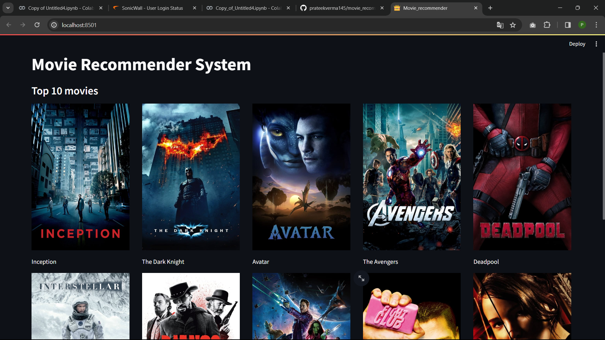
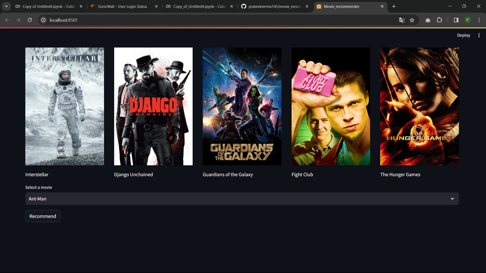

## Movie Recommender - Collaborative Filtering Approach

# Overview

Welcome to the Movie Recommender project! This collaborative filtering-based system is designed to provide personalized movie recommendations by leveraging user preferences and similarities. The algorithm analyzes user behavior and preferences to suggest movies that align with their tastes, creating an enhanced and enjoyable viewing experience.

# Features
 - Collaborative Filtering: Utilizes collaborative filtering techniques to identify patterns and similarities among users, recommending movies based on the preferences of similar users.

- Personalized Recommendations: Tailors movie suggestions to each user, ensuring a personalized and relevant selection of films.

- User-Friendly Interface: A simple and intuitive interface allows users to easily input preferences and receive instant movie recommendations

## Screenshot

